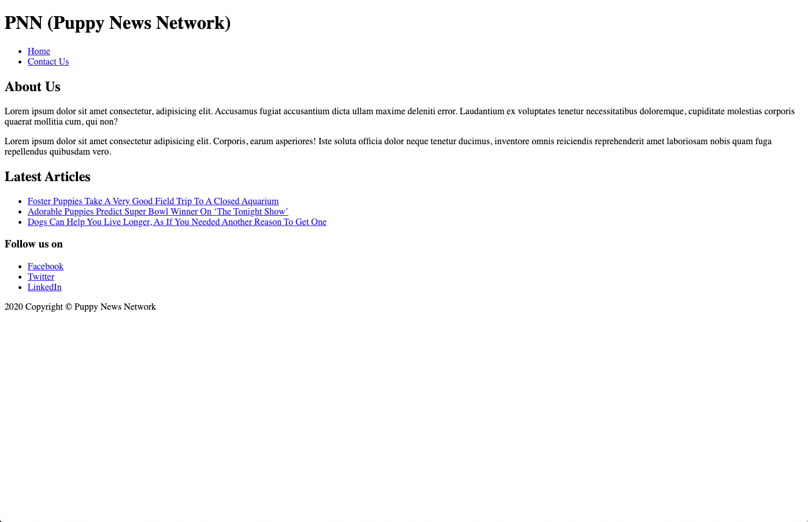
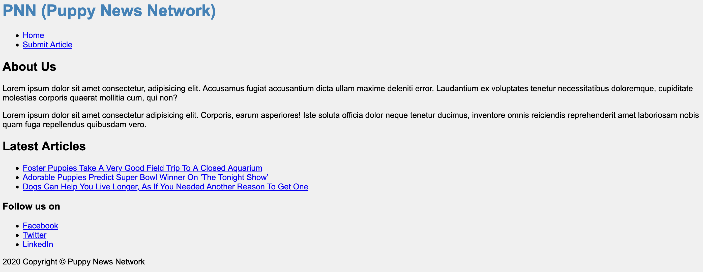

# Intro to HTML and CSS Tutorial

You recently landed an internship with a new startup called PNN, the Puppy News Network. So far, their writers have produced three articles, so it's time to launch a website. This is a new project that you'll create from scratch.

## Step One: Create the home page

Open the `tutorial-student` folder in VS Code by right-clicking on the folder and selecting "Open With Code". Then create a new document, `index.html`, in the root of the project—that is, in the same directory as the `README.md` file:

```html
<!DOCTYPE html>
<html lang="en">
  <head>
    <meta charset="UTF-8">
    <meta name="viewport" content="width=device-width, initial-scale=1.0">
    <title>Document</title>
  </head>
  <body>

  </body>
</html>
```

> You can either copy and paste the code into the file, or you can use the Emmet shortcut that was mentioned in the Student Book: `!+tab`.

Next, you'll update the page title. This is the text that's displayed in the browser tab:

```html
<head>
  <meta charset="UTF-8">
  <meta name="viewport" content="width=device-width, initial-scale=1.0">
  <title>PNN (Puppy News Network)</title>
</head>
```

### Step Two: Create the header and about us page

The first thing your visitors should see is the name of your company. A good element to display this text in is a Heading 1, or `<h1>`:

```html
<h1>PNN (Puppy News Network)</h1>
```

Next, you need links at the top of your page so your visitors can navigate around the site. A good element to put navigation in is the `<nav>` element. The navigation is an unordered list, and each list item has a link to a page.

To start, you'll add navigation links for the home page, `index.html`, and a submission page, `submit.html`, which you haven't created yet.

Here's the code you need to create the navigation:

```html
<nav>
  <ul>
    <li><a href="index.html">Home</a></li>
    <li><a href="submit.html">Submit Article</a></li>
  </ul>
</nav>
```

While both the `h1` and `nav` element can stand alone, it seems like these can be grouped together using another element. Without looking at the code below, do you know what element you can use to group these together at the top of a document?

```html
<header>
  <h1>PNN (Puppy News Network)</h1>
  <nav>
    <ul>
      <li><a href="index.html">Home</a></li>
      <li><a href="submit.html">Submit Article</a></li>
    </ul>
  </nav>
</header>
```

After the header, you want to tell your visitors about the Puppy News Network. You can use the `<section>` element to signify that this is a stand-alone section. Typically, a section has a heading, but that isn't required. You already have a Heading 1, so the next heading is `<h2>`:

```html
<section>
  <h2>About Us</h2>

</section>
```

Below the "About Us" heading, still in the `section`, you'll add in two paragraphs of content. You can copy and paste this text into the file, if you want. There's also an Emmet shortcut you can use, too: with your cursor below the `<h2>`, type `p*2>lorem` and press `tab`. If it works, you have two paragraphs of Lorem ipsum text:

```html
<p>
  Lorem ipsum dolor sit amet consectetur, adipisicing elit. Accusamus fugiat
  accusantium dicta ullam maxime deleniti error. Laudantium ex voluptates
  tenetur necessitatibus doloremque, cupiditate molestias corporis quaerat
  mollitia cum, qui non?
</p>
<p>
  Lorem ipsum dolor sit amet consectetur adipisicing elit. Corporis, earum
  asperiores! Iste soluta officia dolor neque tenetur ducimus, inventore omnis
  reiciendis reprehenderit amet laboriosam nobis quam fuga repellendus quibusdam
  vero.
</p>
```

> What is Lorem ipsum? Lorem ipsum is placeholder text commonly used to demonstrate the visual form of a document or a typeface without relying on meaningful content.

### Step Three: Display the latest articles

Below the "About Us" section, you'll display the latest articles from the Puppy News Network. Currently, there are three articles that you need to display. Again, you'll start with a `<section>` and `<h2>`:

```html
<section>
  <h2>Latest Articles</h2>

</section>
```

Next, create a unordered list of links that the visitor can click on to view the articles. You'll find the news articles in the `news/` directory.

Before looking at the solution, use the information below to create the list of latest articles:

- Article 1
  - title: Foster Puppies Take A Very Good Field Trip To A Closed Aquarium
  - link: puppy-aquarium.html
- Article 2
  - title: Adorable Puppies Predict Super Bowl Winner On "The Tonight Show"
  - link: super-bowl.html
- Article 3
  - title: Dogs Can Help You Live Longer, As If You Needed Another Reason To Get One
  - link: live-longer.html

```html
<section>
  <h2>Latest Articles</h2>
  <ul>
    <li>
      <a href="news/puppy-aquarium.html">Foster Puppies Take A Very Good Field Trip To A Closed Aquarium</a>
    </li>
    <li>
      <a href="news/super-bowl.html">Adorable Puppies Predict Super Bowl Winner On "The Tonight Show"</a>
    </li>
    <li>
      <a href="news/live-longer.html">Dogs Can Help You Live Longer, As If You Needed Another Reason To Get One</a>
    </li>
  </ul>
</section>
```

### Step Four: Add main content and footer

The main content on your home page is "About Us" and the "Latest Articles" sections. There is a semantic HTML element that you can use to group these sections: the `<main>` element.

The HTML `<main>` element contains the primary content directly related to the `<body>` of a page. Add a start and end tag around the two sections:

```html
<main>
  <section>
    <h2>About Us</h2>
    <p>
      Lorem ipsum dolor sit amet consectetur, adipisicing elit. Accusamus fugiat
      accusantium dicta ullam maxime deleniti error. Laudantium ex voluptates
      tenetur necessitatibus doloremque, cupiditate molestias corporis quaerat
      mollitia cum, qui non?
    </p>
    <p>
      Lorem ipsum dolor sit amet consectetur adipisicing elit. Corporis, earum
      asperiores! Iste soluta officia dolor neque tenetur ducimus, inventore
      omnis reiciendis reprehenderit amet laboriosam nobis quam fuga repellendus
      quibusdam vero.
    </p>
  </section>
  <section>
    <h2>Latest Articles</h2>
    <ul>
      <li>
        <a href="news/puppy-aquarium.html">Foster Puppies Take A Very Good Field Trip To A Closed Aquarium</a>
      </li>
      <li>
        <a href="news/super-bowl.html">Adorable Puppies Predict Super Bowl Winner On ‘The Tonight Show’</a>
      </li>
      <li>
        <a href="news/live-longer.html">Dogs Can Help You Live Longer, As If You Needed Another Reason To Get One</a>
      </li>
    </ul>
  </section>
</main>
```

Lastly, you'll create a footer. The footer contain links to PNN's various social networks and a copyright notification. Add this code after the `<main>` section:

```html
<footer>
  <h3>Follow us on</h3>
  <ul>
    <li><a href="https://www.facebook.com">Facebook</a></li>
    <li><a href="https://www.twitter.com">Twitter</a></li>
    <li><a href="https://www.linkedin.com">LinkedIn</a></li>
  </ul>
  <p>2020 Copyright &copy; Puppy News Network</p>
</footer>
```

### Step Five: Run the home page with Live Server

If you followed the steps correctly, you'll have everything you need to launch your home page. In Visual Studio Code, right-click on `index.html` from the Explorer and choose `Open with Live Server`.



If you click on each article in the "Latest Articles" section, you'll notice that the first two look fine, but the third one needs some work.

## Step Six: Update the third news item

After further investigation, the third news item `live-longer.html` is unfinished. There are two issues that need to be addressed here:

1. The links in the header don't work.
2. The news article contains the raw content. You need to add the appropriate markup to the document.

> If you get stuck, look at the other completed articles.

## Step Seven: Create the submission page

At the top of each page is a link to submit an article. At the bottom of each news article is a section encouraging visitors to submit their articles.

Start by creating a new document, `submit.html`, and include the same header and footer that the home page has for consistency:

```html
<!DOCTYPE html>
<html lang="en">
  <head>
    <meta charset="UTF-8">
    <meta name="viewport" content="width=device-width, initial-scale=1.0">
    <title>PNN (Puppy News Network)</title>
  </head>
  <body>
    <header>
      <h1>PNN (Puppy News Network)</h1>
      <nav>
        <ul>
          <li><a href="index.html">Home</a></li>
          <li><a href="submit.html">Submit Article</a></li>
        </ul>
      </nav>
    </header>

    <footer>
      <h3>Follow us on</h3>
      <ul>
        <li><a href="https://www.facebook.com">Facebook</a></li>
        <li><a href="https://www.twitter.com">Twitter</a></li>
        <li><a href="https://www.linkedin.com">LinkedIn</a></li>
      </ul>
      <p>2020 Copyright © Puppy News Network</p>
    </footer>
  </body>
</html>
```

The main part of this page is the form to collect visitors' submissions. Start with the `<main>` element to give meaning to this section and present the user with a heading and text with information about this page:

```html
<main>
  <h1>Submit Article</h1>
  <p>Submit your puppy news using the form below</p>
  <!-- submission form -->
</main>
```

Next, create a form to collect information about the article. Each field that you need to collect information from the user must have a label and a form control.

You can use an empty div, `<div>&nbsp;</div>`, between each of the fields to create some space. Try and create the form on your own before looking at the solution:

- Form
  - action: `http://www.puppynewsnetwork.dev/api/articles`
  - method: `POST`
- Input
  - label: "Name:"
  - id: `name`
  - name: `name`
  - type: `text`
- Input
  - label: "Email Address:"
  - id: `email`
  - name: `email`
  - type: `email`
- Input
  - label: "Puppy News Title:"
  - id: `title`
  - name: `title`
  - type: `text`
- Textarea
  - label: "Puppy News Article:"
  - id: `body`
  - name: `body`
  - rows: `10`
  - cols: `60`

```html
<main>
  <h1>Submit Article</h1>
  <p>Submit your puppy news using the form below</p>
  <!-- submission form -->
  <form action="http://www.puppynewsnetwork.dev/api/articles" method="POST">
    <label for="name">Name:</label>
    <input type="text" id="name" name="name" />
    <div>&nbsp;</div>

    <label for="email">Email Address:</label>
    <input type="email" id="email" name="email" />
    <div>&nbsp;</div>

    <label for="title">Puppy News Title:</label>
    <input type="text" id="title" name="title" />
    <div>&nbsp;</div>

    <label for="body">Puppy News Article:</label>
    <div>&nbsp;</div>
    <textarea id="body" name="body" rows="10" cols="60"></textarea>
  </form>
</main>
```

> You'll learn some techniques throughout the week that make styling forms much easier.

## Step Eight: Add CSS

To put the finishing touches on the Puppy News Network, you'll add a few styles. Start by creating a new directory called `css` and a new file called `styles.css`.

In `styles.css`, create a type selector for the `body`:

```css
body {
}
```

In the body, you'll create two style declarations. The first updates the `font-family` to `Arial, Helvetica, sans-serif;`. The second updates the background color of the page to a subtle grey, `#f0f0f0;`:

```css
body {
  font-family: Arial, Helvetica, sans-serif;
  background-color: #f0f0f0;
}
```

Next, update the color of all the Heading 1 elements:

```css
h1 {
  color: steelblue;
}
```

Finally, you need to add the style sheet to each of your documents. The path to the style sheet is relative to the document. If you're adding a link to the style sheet in `index.html` or `submit.html`, the link looks like this:

```html
<link rel="stylesheet" href="css/styles.css" />
```

It must go below the title in the `<head>` section:

```html
<head></head>
  <meta charset="UTF-8">
  <meta name="viewport" content="width=device-width, initial-scale=1.0">
  <title>PNN (Puppy News Network)</title>
  <link rel="stylesheet" href="css/styles.css" />
</head>
```

When you add the style sheet to each of the three news articles, the path will be different. To get to the css directory, you need to move back one directory (`../`) and then go into the `css/` directory. The path looks like this:

```html
<link rel="stylesheet" href="../css/styles.css" />
```

If you followed the steps correctly, this is the final product:



## Summary

In this tutorial, you learned how to create a new home page that informs visitors about the company and displays the company's recent articles. You also gave visitors a way to submit articles.

It might not be the best-looking website, but the structure is solid. Just like building a house, you need to start with a strong foundation and the cosmetic additions can be added later.
